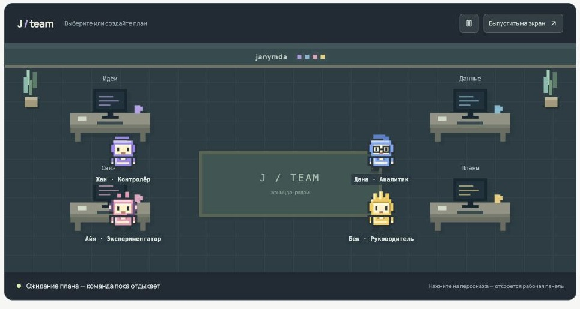
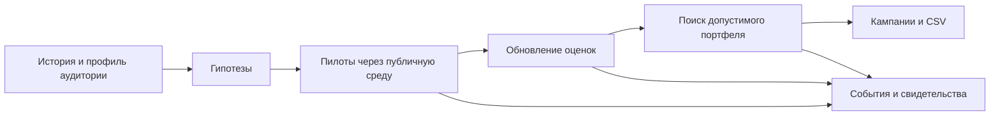
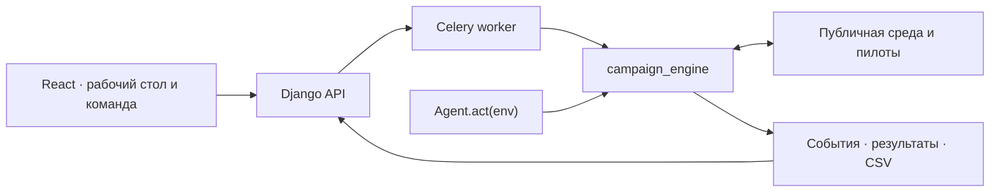

<p align="center">
  
</p>

<h1 align="center">Janymda <sub>by RedOrda</sub></h1>

<p align="center">
  <strong>AI-команда, которая превращает данные об абонентах в проверенный план тарифных кампаний.</strong><br>
  История → гипотезы → пилоты → портфель в пределах бюджета → CSV.
</p>

<p align="center">
  <a href="https://hack.1ge.kz">Открыть демо</a> ·
  <a href="#запуск-за-одну-команду">Запустить через Docker</a> ·
  <a href="#сценарий-для-проверки">Проверить решение</a> ·
  <a href="docs/api-contract.md">API-контракт</a>
</p>

<p align="center">
  
  
  
  
</p>



<sub>Реальный экран интерфейса. В кейсе используются синтетические данные; показанное состояние команды зависит от выбранного плана.</sub>

## Задача

В тарифном маркетинге недостаточно найти аудиторию с высоким ARPU: переход может уменьшить выручку, а каждый контакт расходует деньги и охват. История описывает другую выборку, поэтому агент сначала проверяет гипотезы небольшими пилотами, затем выбирает кампании по полученным наблюдениям.

| Аудитория кейса | Ресурсы агента | Итог |
| --- | --- | --- |
| 23 441 синтетических абонента · 21 тариф · 4 канала | 100 000 у. е. · 15 000 контактов, включая пилоты · до 20 пилотов | До 10 кампаний: **кому**, **какой тариф** и **через какой канал** предложить |

> [!NOTE]
> Сайт, локальный симулятор и судейский `Agent.act(env)` используют один `campaign_engine`. Локальные прогнозы и результаты на публичном моке не являются баллом закрытого оценщика.

## Запуск за одну команду

Нужны **Docker с Compose v2 и Bash**. Python, Node.js и PostgreSQL на компьютере проверяющего не требуются.

1. Скачайте [официальный ZIP участника](https://drive.google.com/file/d/1cQUKtE_cm9TVXgzpcFwQYYUpmuFaJHHT/view). Он не включён в Git.
2. Клонируйте репозиторий и запустите установку с абсолютным путём к скачанному ZIP:

```bash
git clone https://github.com/BAITC-Hacks/hack-182682a3-redorda.git
cd hack-182682a3-redorda
bash scripts/quickstart-compose.sh "/absolute/path/to/participant-kit.zip"
```

3. В приглашении `createsuperuser` задайте **свои** имя пользователя и пароль. Откройте **[localhost:5173](http://localhost:5173)** и войдите под этой учётной записью.

Скрипт создаёт локальный `.env` со случайными секретами, проверяет SHA-256 архива, распаковывает его через Docker, поднимает PostgreSQL, Redis, Django, Celery и React, импортирует полный набор и проверяет готовность агента. Существующий `.env` он сохраняет без изменений. Готовых логинов и паролей в репозитории нет.

> [!TIP]
> Если запуск был неинтерактивным, создайте пользователя командой `docker compose exec backend python backend/manage.py createsuperuser`. Статус контейнеров: `docker compose ps`; готовность API: `curl -fsS http://localhost:5173/api/v1/ready/`.

<details>
<summary>Посмотреть интерфейс без ZIP</summary>

Запустите `bash scripts/quickstart-compose.sh`, создайте пользователя и в разделе **«Аудитория»** нажмите **«Импортировать демоданные»**. Четыре включённых CSV позволяют изучить данные и сохранить черновик. Для пилотов и расчёта нужен полный ZIP с `customer_profile.csv`; после его получения повторите команду с путём к архиву.

</details>

## Сценарий для проверки

1. **Аудитория.** После полного импорта откройте сводку: профиль абонентов и справочники становятся входом агента.
2. **План.** Создайте запуск с бюджетом, лимитом контактов, числом пилотов и seed. `baseline` работает без внешнего API-ключа.
3. **Решение.** Запустите расчёт. Смотрите пилоты, расход ресурсов, журнал событий, задачи команды и кампании в двух представлениях одного запуска.
4. **Результат.** Откройте объяснения и сравнение доступных вариантов, затем скачайте сохранённый CSV. Новый набор ограничений создаёт отдельный план.

Экспорт читает сохранённый результат и не запускает пилоты повторно. Предполагаемый эффект, фактические расходы пилотов и плановая стоимость кампаний обозначаются раздельно. Поле результата симулятора остаётся `null`, если веб-запуск не выполнял отдельную оценку.

Живая команда получает задачи пяти ролей, результаты и передачи из реальных шагов движка. `explain` объясняет выбранную кампанию по сохранённым фактам. `compare` проверяет, какая начальная часть сохранённого портфеля укладывается в новые ограничения, включая уже потраченные ресурсы пилотов. Это ограниченный сценарий, а не полный поиск нового портфеля; обе команды не проводят дополнительных пилотов. Границы сравнения описаны в [API-контракте](docs/api-contract.md). Ограничение каналов для нового запуска пока не поддерживается.

## Почему здесь нужен агент



Агент не получает истинные эффекты заранее. Он расходует ограниченный бюджет на пилоты, учитывает их результаты при выборе каналов и сегментов, а затем проверяет итоговый портфель по общим лимитам. После пилотов ограниченный поиск может заменить кампанию, канал или порядок; он сохраняет вариант только при улучшении **прогнозной** цели. Это не обещание улучшить фактический результат на каждом seed.

**LLM — дополнительный источник структурированных гипотез.** При отсутствии ключа или ошибке провайдера расчётная стратегия продолжает работу. Проверка лимитов и вызовы публичной среды остаются в коде движка.

## Проверки и воспроизводимость

- **Стандартный `Agent.act(env)`.** Официальный локальный `local_eval --runs 10` на seed 0–9 дал **10/10 валидных запусков с положительным net** без LLM. Средний чистый результат — **≈1 081 397 у. е.**, медиана — 1 133 155; в каждом запуске 14 пилотов, 8–10 кампаний и соблюдены лимиты. Это результат публичного мока на seed разработки, а не балл судейства.
- **Воспроизводимая сдача.** Два отдельных процесса `make_submission` с seed 42 и автономная сборка дали побайтово одинаковый CSV: 9 кампаний, 14 пилотов, 15 000 контактов и 99 994 у. е. расходов. Автономный агент повторил все десять локальных результатов.
- **Отдельный эксперимент с поиском портфеля.** При фиксированных пилотах `fixed_200` на **11 парных dev-seed** средний измеренный net вырос с 1 373 058 до 1 495 713 у. е. (**+8,93%**): 6 улучшений, 1 совпадение, 4 ухудшения. Это другая конфигурация; её среднее не является результатом стандартного адаптивного агента. [Протокол и границы вывода](docs/developers/02-portfolio-search.md).

<details>
<summary>Команды для независимой локальной проверки</summary>

После установки Python 3.11+ и Node.js 20.19+:

```bash
make setup
.venv/bin/python scripts/import_participant_kit.py "/absolute/path/to/participant-kit.zip"
PYTHON_DOTENV_DISABLED=1 .venv/bin/python scripts/run_official.py local_eval --runs 10
PYTHON_DOTENV_DISABLED=1 .venv/bin/python scripts/run_official.py make_submission
.venv/bin/python scripts/build_agent.py --submission artifacts/submission.csv
make schema
make check
```

Готовый для копирования комплект создаётся в `artifacts/delivery/`: автономный `agent.py`, `submission.csv` и минимальные зависимости. Сгенерированные артефакты и пакет организаторов не входят в Git. [ТЗ конкурса](https://docs.google.com/document/d/1bt_tgnIXnsnGMMjeaqbOY165MXmYQOTllRCDwcKySKI/preview) · [Подробный протокол поиска](docs/developers/02-portfolio-search.md).

</details>

## Архитектура



| Слой | Ответственность |
| --- | --- |
| `frontend/` | Два представления запуска, персонажи, импорт данных, управление планом и экспорт |
| `backend/` | Авторизация, хранение наборов и запусков, очередь, события, результаты и HTTP API |
| `packages/campaign_engine/` | Общая стратегия для веба и судейского `Agent.act`, пилоты, оценки, ограничения и портфель |
| `agent.py` / `scripts/build_agent.py` | Конкурсный вход и автономная сборка для передачи организаторам |

**Документация:** [API и авторизация](docs/api-contract.md) · [OpenAPI](docs/openapi.yaml) · [развёртывание](docs/deployment.md) · [контракт живой команды](docs/team-contract.md) · [конкурсный агент](docs/developers/02-agent-integration.md).

<sub>RedOrda · HackAlem AI 2026 · Beeline Tariff Marketing Campaigns. Все данные и суммы кейса синтетические.</sub>
