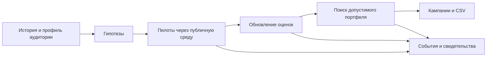
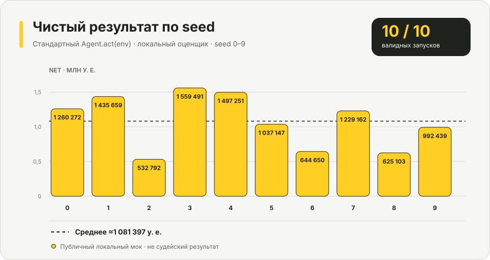
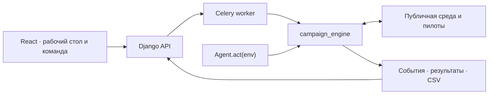

<p align="center">
  
</p>

<h1 align="center">Janymda <sub>by RedOrda</sub></h1>

<p align="center">
  <strong>AI-команда, которая превращает данные об абонентах в проверенный план тарифных кампаний.</strong><br>
  История → гипотезы → пилоты → портфель в пределах бюджета → CSV.
</p>

<p align="center">
  <a href="#запуск-за-одну-команду">Запустить у себя через Docker</a> ·
  <a href="#сценарий-для-проверки">Проверить решение</a> ·
  <a href="docs/api-contract.md">API-контракт</a>
</p>

<p align="center">
  
  
  
  
</p>


<sub>Реальный экран интерфейса. В кейсе используются синтетические данные; показанное состояние команды зависит от выбранного плана.</sub>

## Задача

В тарифном маркетинге недостаточно найти аудиторию с высоким ARPU: переход может уменьшить выручку, а каждый контакт расходует деньги и охват. История описывает другую выборку, поэтому агент сначала проверяет гипотезы небольшими пилотами, затем выбирает кампании по полученным наблюдениям.

| Аудитория кейса | Ресурсы агента | Итог |
| --- | --- | --- |
| 23 441 синтетических абонента · 21 тариф · 4 канала | 100 000 у. е. · 15 000 контактов, включая пилоты · до 20 пилотов | До 10 кампаний: **кому**, **какой тариф** и **через какой канал** предложить |

> [!NOTE]
> Локальное приложение и судейский `Agent.act(env)` используют один `campaign_engine`. Прогнозы и результаты на публичном моке не являются баллом закрытого оценщика.

## Запуск за одну команду

Нужны **запущенный Docker с Compose v2 и Bash**. Python, Node.js и PostgreSQL на компьютере проверяющего не требуются.

1. Скачайте [официальный ZIP участника](https://drive.google.com/file/d/1cQUKtE_cm9TVXgzpcFwQYYUpmuFaJHHT/view). Он не включён в Git.
2. Клонируйте репозиторий и запустите установку с **реальным абсолютным путём** к скачанному ZIP; имя файла у вас может отличаться от примера:

```bash
git clone https://github.com/BAITC-Hacks/hack-182682a3-redorda.git
cd hack-182682a3-redorda
bash scripts/quickstart-compose.sh "/absolute/path/to/participant-kit.zip"
```

3. В приглашении `createsuperuser` задайте **свои** имя пользователя и пароль. Откройте **[localhost:5173](http://localhost:5173)** и войдите под этой учётной записью.

Скрипт создаёт локальный `.env` со случайными секретами, проверяет SHA-256 архива, распаковывает его через Docker, поднимает PostgreSQL, Redis, Django, Celery и React, импортирует полный набор и проверяет готовность агента. Существующий `.env` он сохраняет без изменений. Готовых логинов и паролей в репозитории нет.

> [!TIP]
> Если запуск был неинтерактивным, создайте пользователя командой `docker compose exec backend python backend/manage.py createsuperuser`. Статус контейнеров: `docker compose ps -a`; готовность API: `curl -fsS http://localhost:5173/api/v1/ready/`.

**Контрольные точки после запуска:**

| Проверка | Ожидаемый результат |
| --- | --- |
| `docker compose ps -a` | `db`, `redis`, `backend`, `worker` и `frontend` работают; `migrate` завершился с кодом 0 |
| `docker compose exec -T backend python backend/manage.py check_agent` | `Agent preflight: OK` и профиль из 23 441 абонента |
| Новый план в браузере | Расчёт доходит до результата; кампании и CSV доступны в карточке запуска |

<details>
<summary>Посмотреть интерфейс без ZIP</summary>

Запустите `bash scripts/quickstart-compose.sh`, создайте пользователя и в разделе **«Аудитория»** нажмите **«Импортировать демоданные»**. Четыре включённых CSV позволяют изучить данные и сохранить черновик. Для пилотов и расчёта нужен полный ZIP с `customer_profile.csv`; после его получения повторите команду с путём к архиву.

</details>

<details>
<summary>Если запуск остановился</summary>

```bash
docker compose ps -a
docker compose logs --tail=120 backend worker frontend
```

Повторный запуск `bash scripts/quickstart-compose.sh "/absolute/path/to/participant-kit.zip"` сохраняет существующий `.env`. Если вы изменили переменные в нём вручную, пересоздайте контейнеры: `docker compose up -d --force-recreate backend worker`. [Подробная инструкция Compose](docs/deployment.md#compose).

</details>

## Сценарий для проверки

1. **Аудитория.** После полного импорта откройте сводку: профиль абонентов и справочники становятся входом агента.
2. **План.** Создайте запуск с бюджетом, лимитом контактов, числом пилотов и seed. `baseline` работает без внешнего API-ключа.
3. **Решение.** Запустите расчёт. Смотрите пилоты, расход ресурсов, журнал событий, задачи команды и кампании в двух представлениях одного запуска.
4. **Результат.** Откройте объяснения и сравнение доступных вариантов, затем скачайте сохранённый CSV. Новый набор ограничений создаёт отдельный план.

Экспорт читает сохранённый результат и не запускает пилоты повторно. Предполагаемый эффект, фактические расходы пилотов и плановая стоимость кампаний обозначаются раздельно. Поле результата симулятора остаётся `null`, если веб-запуск не выполнял отдельную оценку.

Живая команда получает задачи пяти ролей, результаты и передачи из реальных шагов движка. `explain` объясняет выбранную кампанию по сохранённым фактам. `compare` проверяет, какая начальная часть сохранённого портфеля укладывается в новые ограничения, включая уже потраченные ресурсы пилотов. Это ограниченный сценарий, а не полный поиск нового портфеля; обе команды не проводят дополнительных пилотов. Границы сравнения описаны в [API-контракте](docs/api-contract.md). Ограничение каналов для нового запуска пока не поддерживается.

## Почему здесь нужен агент



Агент не получает истинные эффекты заранее. Он расходует ограниченный бюджет на пилоты, учитывает их результаты при выборе каналов и сегментов, а затем проверяет итоговый портфель по общим лимитам. После пилотов ограниченный поиск может заменить кампанию, канал или порядок; он сохраняет вариант только при улучшении **прогнозной** цели. Это не обещание улучшить фактический результат на каждом seed.

**LLM — дополнительный источник структурированных гипотез.** При отсутствии ключа или ошибке провайдера расчётная стратегия продолжает работу. Проверка лимитов и вызовы публичной среды остаются в коде движка.

## Результаты, которые можно повторить

> [!IMPORTANT]
> Все цифры ниже получены на **публичном локальном моке** и seed, использованных при разработке. Это измеренный результат локального симулятора, не прогноз веб-интерфейса и не балл закрытого судейства. Данные кейса синтетические. Срез: **23 сентября 2026**, версия агента [`d91aabc`](https://github.com/BAITC-Hacks/hack-182682a3-redorda/commit/d91aabc27c0052116b5a5bdfdf53fd7ec9808e30).

### Стандартный агент · адаптивные пилоты

| **10 / 10** | **≈1,08 млн у. е.** | **14 пилотов** | **8–10 кампаний** |
| :---: | :---: | :---: | :---: |
| Валидные запуски с положительным net | Средний чистый результат | В каждом запуске, из 20 допустимых | В каждом итоговом плане |

`Agent.act(env)` без вызовов LLM прошёл официальный `local_eval --runs 10` на seed 0–9. Чистый результат учитывает пилоты и финальные кампании: медиана **1 133 155 у. е.**, диапазон **532 792–1 559 491 у. е.** Общие расходы — 97 142–100 000 у. е.; контакты — 9 090–15 000. Проверка лимитов завершилась `OK` в каждом запуске.



<details>
<summary>Все 10 запусков · net, кампании и ресурсы</summary>

| Seed | Чистый результат, у. е. | Кампании | Контакты | Расходы, у. е. |
| ---: | ---: | ---: | ---: | ---: |
| 0 | 1 260 272 | 10 | 13 728 | 98 276 |
| 1 | 1 435 659 | 8 | 15 000 | 97 142 |
| 2 | 532 792 | 10 | 13 592 | 99 466 |
| 3 | 1 559 491 | 9 | 9 090 | 99 982 |
| 4 | 1 497 251 | 8 | 15 000 | 97 456 |
| 5 | 1 037 147 | 10 | 15 000 | 99 984 |
| 6 | 644 650 | 8 | 15 000 | 97 288 |
| 7 | 1 229 162 | 9 | 14 765 | 99 852 |
| 8 | 625 103 | 8 | 15 000 | 98 826 |
| 9 | 992 439 | 9 | 15 000 | 100 000 |

</details>

### Отдельный эксперимент · поиск портфеля

На **одинаковых замороженных пилотах** `fixed_200` сравнили исходный и улучшенный портфели на 11 dev-seed. Средний измеренный net изменился с **1 373 058,47** до **1 495 712,80 у. е.** — **+8,93%**. Из 11 пар: **6 улучшений · 1 совпадение · 4 ухудшения**. Поиск сохраняет улучшение прогнозной цели; роста фактического net на каждом seed он не гарантирует. Это другая конфигурация, и её среднее нельзя приписывать стандартному адаптивному агенту. [Протокол и границы вывода](docs/developers/02-portfolio-search.md).

### Воспроизводимая сдача

Два отдельных процесса `make_submission` с seed 42 и автономная сборка дали побайтово одинаковый CSV: **9 кампаний · 14 пилотов · 15 000 контактов · 99 994 у. е. расходов**. Автономный агент повторил все десять локальных результатов. SHA-256 CSV: `8cffdc8561421204e1fee3de599918304173b3d9acb00fa8462dc395eee0ee52`.

<details>
<summary>Команды для независимой локальной проверки</summary>

После установки Python 3.11+ и Node.js 20.19+:

```bash
make setup
.venv/bin/python scripts/import_participant_kit.py "/absolute/path/to/participant-kit.zip"
PYTHON_DOTENV_DISABLED=1 .venv/bin/python scripts/run_official.py local_eval --runs 10
PYTHON_DOTENV_DISABLED=1 .venv/bin/python scripts/run_official.py make_submission
.venv/bin/python scripts/build_agent.py --submission artifacts/submission.csv
make schema
make check
```

Готовый для копирования комплект создаётся в `artifacts/delivery/`: автономный `agent.py`, `submission.csv` и минимальные зависимости. Сгенерированные артефакты и пакет организаторов не входят в Git. [ТЗ конкурса](https://docs.google.com/document/d/1bt_tgnIXnsnGMMjeaqbOY165MXmYQOTllRCDwcKySKI/preview) · [Подробный протокол поиска](docs/developers/02-portfolio-search.md).

</details>

## Архитектура



| Слой | Ответственность |
| --- | --- |
| `frontend/` | Два представления запуска, персонажи, импорт данных, управление планом и экспорт |
| `backend/` | Авторизация, хранение наборов и запусков, очередь, события, результаты и HTTP API |
| `packages/campaign_engine/` | Общая стратегия для веба и судейского `Agent.act`, пилоты, оценки, ограничения и портфель |
| `agent.py` / `scripts/build_agent.py` | Конкурсный вход и автономная сборка для передачи организаторам |

**Документация:** [API и авторизация](docs/api-contract.md) · [OpenAPI](docs/openapi.yaml) · [развёртывание](docs/deployment.md) · [контракт живой команды](docs/team-contract.md) · [конкурсный агент](docs/developers/02-agent-integration.md).

<sub>RedOrda · HackAlem AI 2026 · Beeline Tariff Marketing Campaigns. Все данные и суммы кейса синтетические.</sub>
